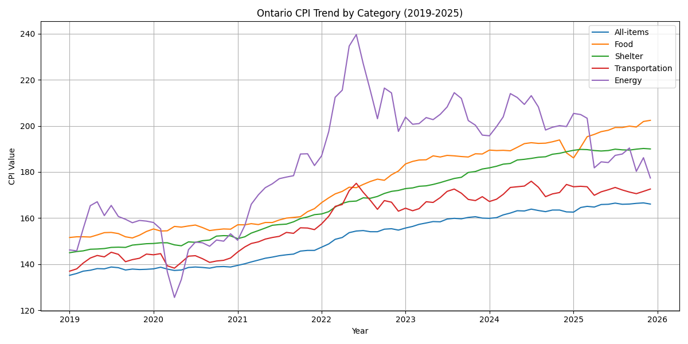

# Ontario Cost of Living & Job Market Analysis



**Author:** Minh Tuan Pham

The **Ontario Cost of Living & Job Market Analysis** is a Python-based data analysis project designed to study economic trends in Ontario from 2019 to 2025.

The project analyzes Consumer Price Index (CPI), major cost-of-living categories, employment, unemployment, and unemployment rate trends using public datasets from Statistics Canada. It transforms raw CSV data into cleaned datasets, visual charts, and an automated Excel report for business-focused insights.

This project demonstrates practical Python skills in data cleaning, data transformation, data visualization, Excel automation, and economic/business analysis.

## Quick Review

The project output can be reviewed through the generated Excel report:

```txt
reports/ontario_economic_report.xlsx
```

The report includes summary tables, CPI comparison, labour market analysis, and dashboard visuals.

## Features

### Data Cleaning & Transformation

* Import raw CSV datasets from Statistics Canada.
* Clean and transform CPI and labour market datasets using Python.
* Handle missing values, duplicate rows, and inconsistent numeric formatting.
* Convert date columns into year and month values for trend analysis.
* Export cleaned datasets for reuse and reporting.

### Cost of Living Analysis

* Analyze Ontario CPI trends from 2019 to 2025.
* Compare major cost-of-living categories:

  * All-items
  * Food
  * Shelter
  * Transportation
  * Energy
* Calculate CPI percentage change from 2019 to 2025.
* Identify the highest and lowest CPI growth categories.
* Visualize monthly and yearly CPI trends.

### Job Market Analysis

* Analyze Ontario labour market trends from 2019 to 2025.
* Track employment, unemployment, and unemployment rate.
* Use seasonally adjusted labour data for cleaner month-to-month comparison.
* Generate visual charts for employment and unemployment trends.
* Support business understanding of labour market changes over time.

### Charts & Visualization

The project automatically generates chart images using Matplotlib.

Generated charts include:

* Ontario CPI Trend by Category
* Average Yearly CPI Comparison
* Ontario Unemployment Rate Trend
* Ontario Employment and Unemployment Trend

Chart output examples:

```txt
charts/ontario_cpi_trend.png
charts/yearly_cpi_comparison.png
charts/unemployment_rate_trend.png
charts/employment_unemployment_trend.png
```

### Excel Report Automation

The project generates an automated Excel report using OpenPyXL.

The Excel report includes:

* Summary sheet
* Yearly CPI analysis
* CPI change from 2019 to 2025
* Labour market summary
* Dashboard with inserted chart visuals

Excel output:

```txt
reports/ontario_economic_report.xlsx
```

## Screenshots

### Excel Summary


### Dashboard


### CPI Trend Chart


### Labour Market Chart


## Technology Stack

* Python
* Pandas
* NumPy
* Matplotlib
* OpenPyXL
* Microsoft Excel
* Statistics Canada public datasets

## Project Structure

```txt
ontario-cost-of-living-job-market-analysis/
│
├── data/
│   ├── raw/
│   │   ├── cpi_ontario.csv
│   │   └── labour_ontario.csv
│   │
│   └── cleaned/
│       ├── cleaned_cpi_ontario.csv
│       └── cleaned_labour_ontario.csv
│
├── src/
│   ├── check_data.py
│   ├── clean_data.py
│   ├── create_charts.py
│   └── generate_excel_report.py
│
├── charts/
│   ├── ontario_cpi_trend.png
│   ├── yearly_cpi_comparison.png
│   ├── unemployment_rate_trend.png
│   └── employment_unemployment_trend.png
│
├── reports/
│   └── ontario_economic_report.xlsx
│
├── screenshots/
│   ├── excel_summary.png
│   ├── dashboard.png
│   ├── cpi_trend.png
│   └── labour_market.png
│
├── requirements.txt
├── .gitignore
└── README.md
```

## Dataset

This project uses public datasets from Statistics Canada.

Datasets used:

* Consumer Price Index, monthly, not seasonally adjusted
* Labour force characteristics, monthly, seasonally adjusted and trend-cycle

The CPI dataset focuses on Ontario and includes:

* All-items
* Food
* Shelter
* Transportation
* Energy

The labour market dataset focuses on Ontario and includes:

* Employment
* Unemployment
* Unemployment rate

## How to Run

### 1. Clone the repository

```bash
git clone https://github.com/your-username/ontario-cost-of-living-job-market-analysis.git
```

### 2. Open the project folder

```bash
cd ontario-cost-of-living-job-market-analysis
```

### 3. Create a virtual environment

```bash
python -m venv venv
```

### 4. Activate the virtual environment

For Windows:

```bash
venv\Scripts\activate
```

### 5. Install required packages

```bash
pip install -r requirements.txt
```

### 6. Check the datasets

```bash
python src/check_data.py
```

### 7. Clean the data

```bash
python src/clean_data.py
```

### 8. Generate charts

```bash
python src/create_charts.py
```

### 9. Generate the Excel report

```bash
python src/generate_excel_report.py
```

### 10. Open the report

```bash
start reports/ontario_economic_report.xlsx
```

## Roadmap

This project is continuously evolving. Core data cleaning, analysis, visualization, and Excel reporting features have been implemented. More advanced features may be added in the future.

### Completed

* Downloaded and organized public datasets
* Cleaned CPI and labour market data using Python
* Created cleaned CSV outputs
* Built CPI and labour market analysis scripts
* Generated visual charts using Matplotlib
* Created automated Excel report with multiple sheets
* Added dashboard visuals to Excel report

### Planned

* Add Streamlit dashboard for interactive data exploration
* Add more CPI categories for deeper cost-of-living analysis
* Add year-over-year inflation calculations
* Add automated PDF report generation
* Improve dashboard design and formatting
* Add forecasting for CPI and unemployment trends
* Add unit tests for data cleaning and analysis scripts

## Business Purpose

This project shows how Python can be used to support business and economic decision-making. By analyzing cost-of-living and labour market trends, the project helps identify changes in inflation pressure, employment conditions, and economic patterns in Ontario.

The project is useful for demonstrating how raw public data can be transformed into meaningful reports, dashboards, and visual insights.

## Skills Demonstrated

* Python scripting
* Data cleaning
* Data transformation
* Data analysis
* Data visualization
* Excel report automation
* Business-focused reporting
* Working with public datasets
* Organizing a professional GitHub project

## Contributing

This is a personal portfolio project and is maintained solely by the author. Contributions are not currently accepted.

## License

This project is licensed under the MIT License.
